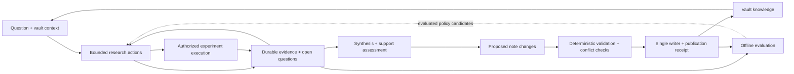

# Obsidian Agent roadmap — controllable research system

For ordered implementation tasks, code entry points and completion checks, use
[TODOS.md](TODOS.md). This roadmap records direction and release gates.

## Direction and provenance

Build an evidence-preserving research system that answers questions, improves an
Obsidian vault safely, executes reproducible experiments when needed, and learns
better research policies through measured evaluation. The destination is one
user-controlled system that can replace the workflows currently served by Feynman
and OpenResearch, without depending on either installed CLI. Better means more
defensible conclusions, recoverable runs, useful knowledge reuse, explicit
permissions, and lower resource use at comparable quality.

This roadmap combines the earlier
[ChatGPT discussion: Compare LangGraph and BAML](https://chatgpt.com/share/6ab9b6b3-1cc0-83ea-986c-4be116484d8e)
with the [Feynman implementation audit](docs/research/feynman-audit.md), recorded
2026-09-27. The audit examines Feynman `0.5.8` at
`fe3fd94943df8c5b519fed14c8485215b206aba8` and includes five runnable offline
characterization checks. Historical Feynman measurements are attributed, not
newly reproduced benchmarks. The [OpenResearch audit](docs/research/openresearch-audit.md)
examines 0.2.10 at `27cb34200fe82957d33d37c143adf086408281d0`, including three
offline characterization checks. No claim of superiority has yet been established.

Everything below is proposed unless explicitly labeled existing.
[ARCHITECTURE.md](ARCHITECTURE.md), especially §§5, 9, 10, and 12, describes current
contracts. Update it with implementation changes, not with aspirational features.
The [code-intelligence plan](app/services/gh_client/plan.md) remains a separate
workstream: consume its existing snapshot/parser capabilities first. Its later
indexes, graph stores, and embedding work are not prerequisites for this roadmap.

The earlier BAML/Jev, trajectory evaluation, DSPy/GEPA, and distillation proposals
are retained below, but dependency adoption follows evidence and product needs.
Conversation API examples, numbers, and suggested thresholds are unverified and
must not become defaults without primary-source checks and local experiments.

## Product contract and non-goals

The first useful product answers technical questions using web, papers, code, and
existing vault knowledge. It produces a concise answer/report, inspectable evidence,
and only the note changes justified by the research. A repeat run can produce a
no-op, a correction, or an explicit unresolved disagreement instead of more notes.
Local/private evidence is valid; it does not need a public URL.

**Existing foundation:** FastAPI, LangGraph, co-located `AgentSpec` definitions,
Pydantic outputs, filesystem ports, virtual workspace/Monty, source/report/memory
persistence, GitHub snapshots, and optional Phoenix/Postgres integrations.
**Missing foundation:** durable evidence-to-claim relationships, run-owned artifact
receipts, enforced research budgets, safe incremental note publication, and a
research-quality baseline demonstrating these behaviors end to end.

Do not copy either application's terminal/dashboard shell, full command catalog,
fixed research team, source quotas, mandatory reading ceremonies, prescribed
experiment-tree shape, GPU fleet or plugin marketplace. Experiment execution is
part of the target, with its own staged delivery below; initial paper/code audits
can identify missing reproduction checks without provisioning compute.

Ownership means local authoritative research records, portable export, inspectable
policies, replaceable source/model/compute adapters, and explicit outbound access.
It does not mean every corpus or model must run locally. Support a strict offline
capability profile with clear unavailable operations; never silently substitute a
hosted service. Keep Phoenix optional and diagnostics local unless export is enabled.

## Reference design and responsibility boundaries

This is a target information flow, not a mandate for one LLM agent per box.
A single researcher may choose most actions. Exact execution, state transitions,
permissions, and publication are code responsibilities. Semantic assessments
remain fallible and never grant authorization or establish truth by themselves.

| Component | Responsibility | Boundary |
|---|---|---|
| Harness and deterministic code | Validate arguments, enforce capabilities/budgets, record outcomes, publish artifacts | No prompt-only security or completion guarantees. |
| LangGraph | Existing orchestration and checkpoints | Keep one orchestration runtime; checkpoint storage alone is not a resume API. |
| Models via `AgentSpec` | Choose research actions, synthesize, assess evidence, propose notes | Reuse current typed call boundary until an alternative wins an experiment. |
| Filesystem-backed records | Run manifest, evidence, assessments, publication receipts | Source of truth for research artifacts; traces are observers. |
| Phoenix | Optional operational visibility | Keep private evidence and unfiltered errors out of exported telemetry. |
| BAML / Jev, candidates | Bounded generation / semantic-assessment experiments | No adoption without calibration, tracing, rollback, and measured benefit. |
| DSPy / GEPA, candidates | Offline policy optimization | No second live production runtime by default. |

### Minimal proposed durable records

Add fields only when the milestone implementing their consumer lands. Keep
`ResearchState` a `TypedDict` and `ResearchContext` frozen. Large source text belongs
in artifacts; state carries references. Schema and prompt remain co-located.

- **Run manifest:** run ID, question/scope, model/tool/policy versions, budgets and
  usage, status, stop reason, required checks, artifact hashes and receipts.
- **Evidence record:** source identity/family/version, URL or local locator,
  acquisition timestamp/status, content hash, retained passage/offset reference,
  extraction method and truncation. Separate raw source from derived summaries.
- **Claim assessment:** claim, evidence references, supports/contradicts/insufficient
  relationship, checked scope, assessor/version, uncertainty, and revision history.
  Start with decisive report claims and every claim promoted into a durable note.
- **Note proposal:** create/update/link/no-op, evidence/claim references, target path,
  expected prior-content hash, and justification. The writer owns application.
- **Experiment specification, when M6 lands:** question/hypothesis, parent or
  comparison references, code/data/environment identities, command, evaluator,
  declared metrics/direction/splits/seeds, allowed capabilities and resource limits.
  Each attempt uses the existing run manifest plus a backend handle and result
  receipt; it is not another independent run database.

JSON/JSONL and Markdown through `FilesystemBackend` are sufficient initially.
A graph-shaped domain does not require a graph database. Add a derived local index
only when measured retrieval latency or corpus size requires it; keep it rebuildable.

## Delivery order

M0 establishes evaluation; M1 makes runs/artifacts reliable; M2 retains evidence;
M3 improves research and verification; M4 closes the vault-update loop; M5 learns
policies. M6 adds real experiment execution and M7 retires the old applications.
M6's bounded local pilot can follow M1–M3 without waiting for policy learning;
its findings feed the same evidence/vault path. M1 and the M0 fixture work can
proceed independently. Dependencies below are release gates, not calendar estimates.

### M0 — Establish a baseline that cannot confuse activity with correctness

**Addresses:** audit F1, F2, F3, F4, F8, F11. **Depends on:** nothing new.

- [ ] Add a stub-model traversal of the current five-node graph through response
  projection and real temporary filesystem persistence. Include failure at each
  boundary; do not infer graph correctness from API routing tests.
- [ ] Build a reviewed pilot corpus spanning narrow factual questions, technical
  comparisons, literature disagreements, paper/code mismatches, unanswerable
  questions, stale memory, private documents, and incremental vault updates.
  Include recent/low-citation work and duplicate/mirrored sources.
- [ ] Carry the five Feynman counterexamples into corresponding new-system tests:
  correct identifier/wrong claim; right surname/wrong title; empty deliverable;
  provider outage; extraction ambiguity. Add citation-free conclusions, citation
  deletion that drops a required question, malicious source instructions, and
  unsupported generated memory as adversarial cases.
- [ ] Separate deterministic integrity checks from labeled semantic support,
  answer correctness, required-facet coverage, contradiction handling, and note
  usefulness. Audit false acceptance/rejection and evaluator disagreement.
- [ ] Capture end-to-end latency, calls, input/output/cache tokens, transferred
  bytes, model-visible bytes, peak RSS, and cost when pricing is known. Unknown
  cost is null/unavailable, never zero. Keep failures/timeouts in denominators.
- [ ] Compare the current pipeline with a simple single-agent baseline. Use paired
  cases, equal enforced budgets once M1 lands, and repeated trials; report
  per-case outcomes and uncertainty rather than a single quality score.
- [ ] Separate training, development, hidden test, and live canaries. Start with
  the reviewed pilot, expand toward 50–100 cases only when useful. Do not tune on
  the hidden set or promote a policy by silently excluding failures.

**Exit gate:** reproducible baseline artifacts and reviewed labels; the scorer
rejects the known false-success cases; evaluation coverage and unresolved blind
spots are explicit. Choose numeric semantic-quality/resource targets from this
baseline before candidate promotion, not after seeing candidate results.

### M1 — Make execution, persistence, and completion trustworthy

**Addresses:** F2, F6, F7, F9, F10 and current overwrite/response bugs.
**Depends on:** M0 failure fixtures for acceptance; does not require new retrieval.

- [ ] Carry the existing run ID to persistence; write under
  `outputs/runs/<run_id>/` with a manifest. Return references from explicit write
  receipts, not existence scans. Never label previous files as this run's outputs.
- [ ] Add explicit running/complete/partial/failed/cancelled states and stop reasons
  such as budget exhaustion, unavailable evidence, provider failure, or conflict.
  Generate status/provenance from recorded checks, not model-written PASS strings.
- [ ] Stage artifacts, validate them, then publish the completion manifest last.
  Use atomic operations where supported, plus a journal/receipts for retry and
  recovery. Do not claim multi-file vault updates are atomic. Replaying a completed
  persistence step must not duplicate notes or memories.
- [ ] Enforce per-run action/call, wall-time, concurrency, input/output and download
  limits in the harness/executor. Reserve budget before dispatch; include retries
  and child work. Provider token caps and deadlines bound in-flight work; account
  for any unavoidable overshoot. Unpriced models still have token/action limits.
- [ ] Add cancellation/status/resume only with an explicit durable run contract.
  Validate vault identity, policy/schema versions and publication receipts on
  resume. No silent resume across incompatible versions. If checkpoint storage
  is ephemeral, say resume is unavailable. External work may outlive cancellation;
  record that outcome instead of claiming remote computation was killed.
- [ ] Resolve the prompt/tool contradictions in ARCHITECTURE.md §12. Prefer one
  supported capability path per operation; test tool availability for each model
  and role. Do not silently rerun a side-effecting agent on ambiguous stream failure.
- [ ] Keep local diagnostics detailed and exports allowlisted/redacted. Provider
  failure must not collapse into absent evidence; observer failure must not change
  the research result. Do not persist hidden chain-of-thought as evidence.
- [ ] Separate execution state, evidence readiness and assessment. A stopped
  process does not imply drained logs, valid artifacts or a supported conclusion.
  Completion receipts state which checks finished; late evidence produces a new
  assessment revision rather than rewriting historical execution outcome.

**Exit gate:** two same-topic concurrent runs cannot overwrite one another;
standalone runs cannot return old artifacts as new; injected crashes/retries,
cancellation, and budget exhaustion produce correct receipts/status and no
unintended writes. Test the actual process/call lifecycle, not just flags.

**Compatibility/rollback:** old `report.md`, CSVs and manual notes remain untouched
as user data; new runs use the new layout. Preserve no dual-write alias. Mark legacy
memories as unverified when read, never fabricate evidence for them. Version the
response/manifest contract and migrate callers together. Rollback must preserve
new run directories and explicitly refuse unsupported resume schemas.

### M2 — Retain evidence before context is discarded

**Addresses:** F1, F4, F5, F7, F8 and source-loss in existing memories.
**Depends on:** M1 run-owned storage; M0 evidence fixtures.

- [ ] Capture stable evidence references as sources are read, before old tool
  output is cleared. Retain permitted bounded snapshots/passages, hashes and
  source locations; record unavailable snapshots and copyright/access constraints.
- [ ] Distinguish not-found, forbidden/unavailable, rate-limited, timeout, parse
  failure, truncated, and inspected results. Do not infer nonexistence from an
  empty query or source falsity from an HTTP failure.
- [ ] Preserve source identity and version separately from URL; group preprints,
  venue versions and mirrors without treating them as independent confirmation.
  Pin code to commit SHA and record dataset revisions when used.
- [ ] Apply streaming byte/deadline/item caps before loading complete responses.
  Fetch metadata first, then relevant sections, then full text only when justified.
  Preserve section offsets, extraction uncertainty and continuation information.
- [ ] Treat sources, prior memories, and derived summaries as untrusted evidence,
  never system instructions. Demote the current privileged-memory wording; retain
  original evidence links and freshness rather than laundering old conclusions.
- [ ] Evaluate one academic discovery/identity adapter against existing web/Exa
  retrieval. Add it only where held-out coverage improves. Reuse the workspace/MCP
  boundaries; avoid a giant query-string language or a new tool per workflow.

**Exit gate:** a decisive claim can be traced back to retained content/version after
context clearing; source failures remain distinct; duplicate indexes do not inflate
evidence diversity; oversized/malformed/instruction-bearing sources cannot escape
bounds or alter authority. Returned snippets alone are not considered a memory cap.

### M3 — Research adaptively and verify what changes the answer

**Addresses:** F1, F3–F6, F11. **Depends on:** M0–M2.

- [ ] Introduce a compact ledger of required questions, candidate claims, supporting
  and contradicting evidence, unresolved leads and remaining budget. Reuse explicit
  state/artifacts; do not build a generic strategy framework.
- [ ] Let the researcher choose bounded actions over composable tools. Scope,
  recency and evidence needs guide retrieval; no mandatory source/query quotas or
  universal citation-count ranking. Record why an investigation stops.
- [ ] Synthesize using evidence references. Run a bounded evidence-assessment pass
  before note extraction; combine deterministic reference/locator checks with
  calibrated semantic support judgments. Begin semantic rejection in shadow mode.
- [ ] A flagged critical claim triggers a bounded repair or explicit uncertainty,
  not an unbounded reviewer loop. Keep removed/changed claims in the audit record;
  recheck required question coverage after edits. Insufficient evidence can be a
  correct answer, not a forced failure or an invitation to invent.
- [ ] Escalate to independent critique for contested/high-consequence claims.
  Test whether separate reviewers outperform one assessor at equal budgets.
  Model agreement is not independent source evidence.
- [ ] Add parallel researchers only after paired evaluation demonstrates benefit.
  Require disjoint tasks, bounded fan-out, cancellation, joins, and artifact
  receipts. Workers cannot publish directly into the vault.
- [ ] Support literature review and paper/code audit as evidence/output criteria
  over shared primitives. Use existing commit snapshots and code IR where useful;
  do not require the entire separate code-intelligence roadmap to ship first.

**Exit gate:** held-out claim support/citation completeness and required coverage
improve without critical integrity regressions; uncertainty is calibrated; resource
cost and failed cases are reported. Ablations isolate gains from evidence capture,
assessment, and optional extra agents. Keep the simpler policy when gains are unclear.

### M4 — Make research improve the vault rather than accumulate files

**Addresses:** F9 and current note/memory weaknesses. **Depends on:** M1–M3.

- [ ] Retrieve relevant existing notes/memories before proposing new notes; use
  existing `ObsidianVaultOperations` for vault semantics. Start with bounded lexical
  retrieval, source identity and links; add an index only after measured need.
- [ ] Generate create/update/link/no-op proposals with evidence, uncertainty and
  expected prior-content hashes. Handle novelty, redundancy and contradictions;
  do not force a fixed note count or silently replace dissenting evidence.
- [ ] Apply changes through one writer with per-vault coordination and conditional
  writes/conflict detection. Preserve manual edits. Automatic application policy
  must be explicit; consequential/conflicting edits are reviewable proposals.
- [ ] Validate links, frontmatter, citations and evidence status after rendering.
  Zettel generation can introduce unsupported claims even from a sound report;
  checking only the report is insufficient. Keep unassessed content as a draft.
- [ ] Store durable source/claim references in notes and memory. Treat old generated
  notes as leads; refresh decisive stale evidence. Track invalidated or superseded
  evidence without silently rewriting historical research.
- [ ] Invalidate vault-profile cache from relevant content changes, not note count
  alone. Measure bounded sampling/retrieval costs on large and nested vaults.

**Exit gate:** repeated research yields justified changes or no-op; simulated manual
edits cause conflicts rather than loss; interrupted/replayed publication is safe;
corrections preserve history and propagate to dependent proposals. Human review
finds the notes reusable and well connected, not merely atomic-looking.

**Recovery:** journal prior versions and applied hashes. Undo only unchanged
agent-applied edits; surface subsequent human changes as conflicts. No blind reset
of a vault and no automatic deletion/backfill of legacy content.

### M5 — Learn better policies from reliable trajectories

**Addresses:** F6, F11, F12; preserves the earlier improvement-loop roadmap.
**Depends on:** M0–M4 for production promotion. Offline bounded trials may start
once their own datasets/contracts exist.

- [ ] Capture observable actions, arguments, outcomes, evidence references,
  artifacts, errors, versions and resources. No dependence on hidden reasoning.
- [ ] Replay fixed evidence for analysis/synthesis/Zettel experiments. Evaluate
  search policies against a frozen corpus/index capable of answering new queries;
  recorded-query replay alone is not a fair retrieval-policy comparison.
- [ ] **BAML trial:** compare one bounded generation stage with `ProviderStrategy`
  on schema/semantic quality, retries, traces, latency and cost. If adopted, replace
  that boundary explicitly; keep one authoritative schema/prompt, not layered parsers.
- [ ] **Jev trials:** context KEEP/TRUNCATE/DROP, Zettel atomicity/novelty/convention
  fit, source/memory relevance/redundancy/support. Calibrate with human labels,
  begin in shadow mode, bound assessor work and preserve recoverable source records.
  Unknown/timeouts preserve evidence rather than silently discard it.
- [ ] **DSPy/GEPA trials:** start offline with fixed-evidence synthesis or notes;
  optimize decomposition, querying, selection, verification and stopping separately
  only when diagnostics identify the relevant bottleneck. Keep successful tactics
  as optional priors/examples rather than mandatory recipes.
- [ ] Mine corrections/failures into training/development, not holdouts. Compare
  paired repeated runs and per-metric regressions. A single score cannot trade away
  data safety or evidence integrity for speed.
- [ ] Version policy lineage with model/tool/evaluator/corpus/optimizer versions,
  parent policy and results. Produce reviewable candidate PRs; promote through
  human approval, shadow runs and live canaries with rollback. Consider automatic
  promotion only after sustained evidence that the gates are reliable.

**Exit gate:** an adopted change has a measured held-out benefit, visible failure
modes, bounded overhead and a tested rollback path. If it does not beat the existing
boundary, remove the experiment instead of keeping both production stacks.

### M6 — Add experiments as evidence-producing actions

**Addresses:** OpenResearch O1–O6. **Depends on:** M1–M3; uses M4 for vault publication.
Do not require M5 optimization to ship useful experiments.

- [ ] Start with one local execution path for a concrete reproduction workflow.
  Reuse Monty for analysis it can already perform. Anything needing packages,
  subprocesses, GPU or network uses a separate execution capability, never a
  silent escape from the current virtual shell. Adapt the agent-facing command
  through the harness grammar/registration and update ARCHITECTURE.md §§9–12.
- [ ] Freeze effective inputs before launch: exact committed source or an explicit
  reviewed snapshot, data/model references and hashes where available, dependency
  locks/environment, evaluator version, seeds, command and intended outputs.
  Fail visibly on missing required inputs; label non-reproducible dependencies.
- [ ] Introduce the smallest submit/status/logs/cancel/result contract at this
  implementation boundary. Publish capabilities such as network policy, isolation,
  deadline enforcement and resource accounting. Reject unsupported requirements;
  adapter availability is not equivalent to permission or readiness.
- [ ] Record launch intent before dispatch, then durable external identity; reconcile
  ambiguous launch outcomes before retry. Handle cancellation across process trees,
  supervisor restart, lost handles and eventual provider status. Enforce timeout,
  concurrency and resource budgets in runtime code. Pin inputs, not credentials.
- [ ] Collect binary-safe logs incrementally by byte offset, with bounded decoding
  buffers, rotation/truncation detection and visible storage failures. Finalize
  evidence before emitting evidence-ready events. Add the two OpenResearch log
  counterexamples as regression cases; successful exit without expected metrics
  must remain assessment-incomplete.
- [ ] Validate typed measurements against the declared evaluator: units, direction,
  configuration, dataset split and source locator. Support repeated seeds and
  uncertainty; judge comparability before declaring a winner. Preserve negative,
  failed and inconclusive results. Do not optimize a hidden test set repeatedly.
- [ ] Use references for derivation, replication and comparisons. Immutable attempt
  inputs are mandatory; a greedy tree, universal repair count, or one changing
  headline score is optional research policy. No graph database is required.
- [ ] Add a remote backend only for an identified workload that local execution
  cannot serve. Prefer the user's existing compute. Test cancellation, cost limits,
  evidence transfer and cleanup independently. Do not require an OpenResearch
  account or reproduce nine backend integrations for catalog parity.

**Exit gate:** reproduce a small CPU experiment end to end from retained inputs,
compare a baseline and variant under the same evaluator, ingest the result as
evidence, and publish a conflict-safe note. Fault injection covers interrupted
submission, restart, ignored TERM, incomplete/invalid logs, missing outputs and
provider unavailability. No duplicate launch after ambiguous failure. Unknown
termination/cost/evidence status stays visible. Remote support has its own gate.

### M7 — Retire Feynman and orx by workflow, with a verified escape path

**Depends on:** the milestones needed by each retained workflow, not every feature
ever shipped by either application. Exact personal workflow inventory is still
to be established; this is a candidate acceptance matrix, not a claim of parity.

| Workflow to retain | Replacement evidence required | Gate |
|---|---|---|
| Question → cited synthesis/literature review | Relevant discovery, original-versus-derived evidence, contradictions, assessed claims, inspectable report | M0–M3 |
| Paper → code audit | Versioned paper and commit, exact code/source locators, explicit untested claims | M2–M3 |
| Reuse/update existing vault knowledge | Safe create/update/link/no-op, preserved human edits and provenance | M4 |
| Baseline → variant experiment | Pinned inputs, real execution, measured comparison and retained evidence | M6 |
| Long job → cancel/recover/continue | Durable status/handles, bounded logs, confirmed termination or explicit unknown, retry-safe subscriptions | M1 + M6 |
| A required remote compute workflow | One selected backend passes the same lifecycle and evidence contract | M6 remote gate |
| Prior research survives removal | Export/import validation and restored offline readability, without either CLI | Migration gate below |

- [ ] Inventory actual workflows and retained data with the user: reports, notes,
  evidence, papers, projects, Git branches/worktrees, attempts, logs, artifacts,
  conversations and custom skills. Explicitly waive unused UI/Overleaf/backend
  features rather than treating their omission as silent parity.
- [ ] Implement import only for retained data. Preserve original IDs/source versions
  and provenance, map to new IDs, and mark unknown claims unassessed. Snapshot
  SQLite consistently using a backup mechanism, not a blind live-file copy; retain
  Git history plus uncommitted/untracked work separately. Keep credentials out of
  research exports. Restore into a temporary location and check counts, hashes,
  references and sampled human-readable results before touching originals.
- [ ] Run representative personal tasks in shadow alongside the originals with
  explicit budgets. Compare correctness/support, failure recovery, usefulness,
  latency, RSS and cost; record waivers and unresolved gaps. No synthetic scalar
  score alone permits retirement.
- [ ] Prove independence in an isolated environment where `feynman` and `orx` are
  unavailable: no subprocess calls, install hooks, prompt instructions or implicit
  file-location dependencies. A source or compute adapter may call an explicitly
  allowed upstream API; it may not secretly require the old application.
- [ ] Export custom workflows as versioned task policies over the implemented
  primitives, keeping permission checks and persistence in deterministic code.
  Add a second adapter/policy only when needed to demonstrate a real extension;
  avoid a speculative plugin runtime and generic factory hierarchy.
- [ ] Keep a restorable backup and last-known-working configuration. Uninstall
  only after the selected acceptance matrix and restoration test pass and the
  user explicitly requests removal. Stop/transfer active jobs first. Removal of
  binaries must not delete research data, worktrees, shared runtimes or credentials.

No compatibility wrapper is proposed. If a temporary `feynman`/`orx` bridge is
needed during migration, the importer owner must document its callers, data
boundary and removal gate; remove it before declaring CLI independence. Search
code, prompts, tests, docs and install instructions for old contracts at that gate.

## Longer-term research: distill behavior into model weights

- [ ] Collect high-quality observable trajectories before training a student.
- [ ] Define a minimal stable action space; translate teacher demonstrations into
  actions the student can execute. Trial corrective review of student actions.
- [ ] Evaluate supervised trajectory distillation first; consider preference
  training or reinforcement learning only for a measured remaining gap.
- [ ] Test unseen questions/domains; remove prompt/harness scaffolding only when
  ablations preserve quality and reliability. Alternate harness and weight
  experiments only after establishing attributable gains.

This preserves the previous roadmap's training direction as research, not a
prerequisite for a useful product. Live information, durable evidence, credentials,
permissions, exact execution and publication integrity remain external. If
production DSPy becomes necessary, reassess whether BAML still earns its place.

## Runtime, deployment and release discipline

The unconstrained reference target is complete lineage, reliable execution,
calibrated assessment, incremental knowledge maintenance and measured improvement.
Pilot size, domain breadth, source coverage, review depth and optimization frequency
are explicit quality dials. Undecidable/open-world truth, incomplete web coverage,
correlated evidence and model nondeterminism are fundamental limits, not budget
compromises. No amount of engineering makes a PASS label proof of truth.

Keep production a modular application on the existing runtime. Bound RSS through
streaming, compact references, incremental records, bounded concurrency and lazy
hydration. Set explicit disk-retention policy for evidence/checkpoints with visible
impact on replay; never silently evict material still needed by durable citations.
Do not rewrite in another language, add resident model servers, or introduce
additional databases without a measured bottleneck.

Ship additive/versioned run artifacts first, then evidence handling, then semantic
policy changes. Diagnose a failure from run ID → status/stop reason → action receipt
→ source/assessment → publication journal. Retain the last known-good policy and
old run data; rollback is a policy/contract choice, not a filesystem wipe.

## First implementation slice

Start with **M0's graph/persistence fixtures and M1's run-owned artifacts/receipts**.
They expose the baseline, prevent cross-run confusion, and give every later
verification result a reliable home. Do not begin with a new model-call library,
a four-agent imitation, or a large search infrastructure project.
